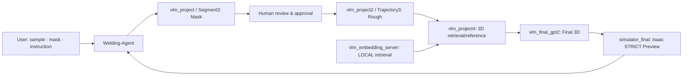

# Welding Agent
## 2026 경남 AI·SW 경진대회

사용자가 용접 영역과 작업 조건을 지정하고 AI 결과를 검토하는 **Human-in-the-Loop 로봇 용접 에이전트**입니다. Vision·Language·Retrieval·GPT로 경로를 생성하고 Isaac Sim에서 로봇 미리보기를 제공합니다. **실제 로봇 실행은 비활성화되어 있습니다.**

## 1. Overview

Dataset sample의 RGB를 선택하고 마스크를 Brush/Eraser로 수정·승인합니다. 자연어 작업 지시를 바탕으로 rough trajectory와 GPT final 3D trajectory를 만들고, 선택된 현재 결과를 Isaac Sim Robot Preview에서 확인합니다. Backend가 sample/job binding, 승인 이력, downstream invalidation과 immutable prediction package를 관리합니다.

## 2. System Architecture



이 도식은 사용자의 작업 순서입니다. **GPT2의 실제 입력**은 native 9-view RGB/seam annotation, 현재 instruction, known start, TRAIN reference입니다. 웹에서 수정한 마스크와 Trajectory3 XYZ를 GPT2에 직접 전달하지 않는 현재 계약을 유지합니다. Final local retrieval은 기존 FAISS/index를 직접 사용하며, Mask/Trajectory3의 native YOLO·retrieval에는 별도 운영자 SSH 설정이 필요합니다.

| 구성 | 역할 |
| --- | --- |
| `backend/`, `frontend/` | FastAPI workflow·Assistant / React·TypeScript·Konva UI |
| `modules/vlm_project` | native 용접 마스크 기본 구현 |
| `modules/vlm_segment2` | 현재 웹 Mask adapter가 실행하는 native 구현 |
| `modules/vlm_project2` | rough 기본 구현 및 native few-shot/reference 공통 코드 |
| `modules/vlm_trajectory3` | 현재 웹 Rough adapter가 실행하는 native 구현 |
| `modules/vlm_project4` | Final 3D retrieval/reference 구현 |
| `modules/vlm_final_gpt2` | GPT Rough → Corners → native interpolation → Final 33점 |
| `modules/vlm_embedding_server/service` | local retrieval source; index·모델은 별도 |
| `modules/simulator_final` | 원래 coordinate/scene/IK/FK/playback을 유지한 simulator source |

## 3. Main Features

- 9-view dataset scene, F mask 편집·검토·승인, 자연어 Assistant
- Rough 결과와 clarification 답변, GPT2 Final 3D prediction
- 원본 XYZ·단위·좌표계 보존 및 현재 job에 연결된 immutable artifact/proof
- simulator_final STRICT Robot Preview, 빨간 경로 선, 최신 캡처·viewport polling
- B_PR_03_0001 endpoint-conditioned 시연 및 sample-specific preview clearance

## 4. Environment & External Assets

Windows PowerShell, backend Python 3.10+, native Python 3.12, Node.js 20.19+ 또는 22.12+, 호환되는 Isaac Sim 설치가 필요합니다. 검증된 native 환경은 Python 3.12 / NumPy 1.26.4이며 backend 환경과 분리합니다.

이 branch는 **source-only**입니다. Dataset H5/OBJ/RGB, retrieval FAISS·`metadata.sqlite`, DINOv2-base/E5-base encoder cache, YOLO weight, Isaac/CAD/robot mesh 자산은 포함하지 않습니다. [필수 외부 파일과 구조](docs/external-assets.md)를 먼저 준비하세요. 모델 다운로드·index 재생성은 자동으로 실행하지 않습니다.

## 5. Run

Repository root에서 실행합니다. 모든 secret은 root `.env`에만 넣습니다.

```powershell
Copy-Item .env.example .env
python -m venv .venv
.\.venv\Scripts\python.exe -m pip install -r backend/requirements.txt
# .env에 dataset/native Python/Isaac launcher 및 필요한 native SSH 설정 입력
.\.venv\Scripts\python.exe scripts/configure_release.py --sample-id B_PR_03_0001
.\.venv\Scripts\python.exe -m uvicorn backend.main:app --host 127.0.0.1 --port 8000
```

다른 PowerShell 창에서:

```powershell
cd frontend
npm.cmd ci
npm.cmd run dev
```

Vite가 출력한 localhost URL을 엽니다. Sample 선택 → Mask 생성/수정·승인 → Instruction/Rough → GPT Final 생성 → **현재 경로 보기** → **로봇 시뮬레이션 보기** 순서로 사용합니다. Simulator backend는 `dataset_final`; launcher는 root `.env`의 `WELD_SIM_LAUNCHER`에 명시합니다. 웹이 임의 명령/경로를 launcher에 전달하지 않습니다. Live는 최신 viewport frame polling이며 스트리밍 영상으로 보장하지 않습니다.

Native dependency 설치와 운영자 설정의 자세한 방법은 [Setup](docs/setup.md), artifact와 API 경계는 [Architecture](docs/architecture.md)를 참고하세요. 외부 자산이 없으면 관련 기능은 준비되지 않은 이유를 표시합니다.

## 6. Important Demo Note

**B_PR_03_0001 endpoint-conditioned demo는 dataset GT endpoint를 명시적으로 제공된 endpoint condition으로 사용합니다. Blind prediction benchmark 결과가 아닙니다.** Known start와 endpoint를 conditioning으로 기록하고 query GT interior trajectory는 모델 입력에 넣지 않습니다. Final 끝점의 사후 snap/warp 없이 native 생성 결과를 보존합니다.

## 7. Safety / Limitations

Simulation/preview only이며 physical robot execution은 disabled입니다. STRICT는 artifact·입력·좌표 계약 검증이며 충돌 안전성이나 하드웨어 실행 인증이 아닙니다. B_PR_03_0001의 orientation/clearance 보정은 simulator preview에만 적용되고 원본 prediction XYZ를 바꾸지 않습니다. Orientation은 simulator policy이며 VLA가 예측한 값이 아닙니다.

파일 기반 storage는 단일 backend process용입니다. 자동 fallback과 자동 승인 없이 사용자 검토를 유지합니다. [검증 및 release 범위](docs/release.md)에 source-only 확인 결과를 기록합니다.
