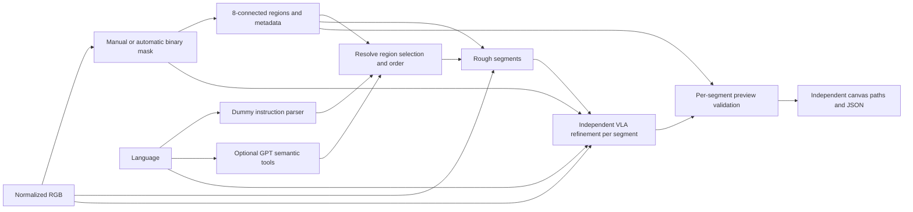
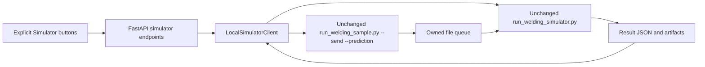

# Architecture and adapter contracts — schema v2

Current display policy: [Visualization first](visualization-first.md). Promotion and robot execution remain strict. The output catalog exposes current and previous outputs without granting workflow authority. Relative GPT output uses `gpt_start_relative_visualization_mm`; visualization retrieval can downgrade with a recorded chain. The owned geometry-only Isaac branch checks job/sample/hash binding but never requests IK or robot playback. It uses a neutral source-frame scene without invented workpiece registration.

Active model settings are backend-owned: Segment2 `mask.model` and
`mask.reasoning_effort` in `.cache/native-integration/configs/segment2.windows.yaml`;
Trajectory3 `models.refiner/planner/reasoning_effort` in `trajectory3.windows.yaml`;
Orchestrator `OPENAI_MODEL` / `WELD_AGENT_REASONING_EFFORT` in root `.env`.
Current target is `gpt-6-luna` / `low` (the API name for light effort).
`SDKRunner` passes the effort through Responses `Reasoning`, independently of
verbosity. It retains serialized tools, tracing/store disabled and backend-only keys.

## Scope and invariants

React/TypeScript/Vite/Konva가 FastAPI/Pydantic v2 REST/SSE API를 호출하는 단일 backend process 로컬 MVP다. 기존 image-pixel 다중 영역 Dummy/native Rough2D preview와 신규 dataset 9-view → Native Segment → Human F approval → NativeRough3D → Guided VLA → VLA_READY를 별도로 지원한다. Canvas 2D guidance, 미정합 retrieved reference 3D, 실제 VLA XYZ는 서로 다른 artifact다. 선택적인 OpenAI Agents SDK Assistant는 구조화 지시와 semantic tool 선택을 담당한다. 물리 로봇은 연결하지 않는다. 기존 Simulator sample replay는 독립적이며 현재 VLA fixture gate는 blocked다.

## 9-view module Workflow

The optional YOLO display resolves the current F-mask's original Segment2 artifact
and exposes sanitized `GET /api/weld/{job_id}/yolo`. Original pixel boxes inherit the
Konva Stage transform; this layer cannot change mask/trajectory conditioning. Source
hashes/camera/sample are checked, bad boxes produce display-only warnings, and stale
asynchronous responses stay hidden. No bbox arrays enter the Agent.
See [schema, audit and lifecycle](yolo-web-visualization.md).

`DatasetScenes` resolves only an exact sample directory and its canonical nine source/label
counterparts, never a recursive dataset scan or similarity search. Upload identity requires the
original filename plus byte SHA-256. `Scene.views` contains image IDs/dimensions/hashes and
per-view masks/approval. `Scene.id`/legacy `job.mask` alias the primary F so old endpoints work.
Private dataset paths and original/normalized image hashes live in `native_context` only.
`NativeSegmentClient.segment_views` runs native defaults once, stores only actual F/R/S4 masks,
and requires human approval. Every mask or instruction edit invalidates downstream results.

`rough_mode` selects `baseline_2d` or `native_3d`. Injected `Rough3DClient` and
`GuidedWorkflowClient` Protocols are separate from the existing image-only Dummy VLA interface.
NativeRough3D uses the original approved-mask session adapter and the explicitly configured
`vlm_trajectory2/cot.py` or `vlm_trajectory3/cot.py`.
Its normalized Canvas points come directly from native 2D JSON; no regenerated points, 3D
projection, reference fitting, or cross-region edges. The current Guided contract supports one
independent F region; multiple regions fail before inference and remain supported by 2D baseline.

`WorkflowGuidedVLAClient` prepares a fresh immutable attempt from the **current job**, not a
latest-job search. It proves sample/split/source images/F approval/mask/guidance/native file hashes,
checks documented `/health` only on explicit action, and reuses the unchanged F-only multipart
writer. `source_job.json` is an immutable conditioning snapshot so the later VLA_READY update
does not stale its own proof. One exclusive submission claim prevents reusing an attempt.
No model retry wrapper or request data is accepted from browser/Agent. GET model status is cached.
The job exposes only counts/frame/metrics/IDs; private response/NPZ/source proofs remain local.
Model provenance comes from the response or explicit health check; unavailable names remain null.

`ROUGH_PATH_READY → VLA_READY` is independent from `VLA_REFINED → VALIDATED` (2D sanity)
and all Simulator runtime states. `simulation_only=true`, `physical_robot_executable=false`,
`simulator_ready=false`. B_PR_TOOL_CLEARANCE_FAIL and registry gates are unchanged.
See [module integration report](module-integration.md) for API and verified browser replay.

## Native model output versus acceptance

`WeldJob.native_output` stores `NativeTrajectoryCandidate` separately from accepted
`rough_trajectory` / `rough3d`. The candidate preserves native string segment/mask IDs,
pixel and normalized arrays, original point order and native direction. No region ID
is fabricated, no vectors are repaired/rebuilt, and each segment renders separately.
Validation issues are typed `HARD_INVALID` or `SOFT_WARNING`, with independent PASS/WARN/FAIL.
Only validated output advances to `ROUGH_PATH_READY`; soft failure remains
`INSTRUCTION_READY`, retains the candidate and returns HTTP 200. Generation missing or
partial returns a safe error and persists an artifact summary for the frontend to refresh.

The supervisor captures hashes of a single fresh owned Rough3D attempt, even when the
complete-result reader rejects it. `strict_aux=False` is used only to recover an unaccepted
candidate when a final plan exists but reports/images are unfinished; every native JSON copy,
sample/instruction/reference/refiner/YOLO/approved-branch contract remains hard. A guidance
file without a final ready plan remains partial and is never promoted to a trajectory.
Normal complete reading, accepted guidance and the Guided multipart writer remain strict.

Immutable private `.native-output.json` proofs bind native bytes, source and normalized RGB,
current mask bytes/pixels/approval, instruction, candidate/report hash and the approved native
input session. Agent run admission, fixed original-image routes and downstream use
recheck those proofs. Public job reads can return a failed acceptance report with an
independently verified immutable display snapshot; this never promotes a candidate.
`GET /api/weld/{job_id}/native-output/image/{kind}` allowlists guidance/reference/review/query
images, without accepting paths or exposing Markdown/reasoning. Model points go to Canvas
REST only; Agent workspace/tool results receive counts/status/issues, never arrays or paths.

Workflow and Guided client both require validated/PASS output and matching current proof
before any health/prediction call. Legacy saved jobs without the optional report retain their
existing strict Guided checks. `user_override=false`, `override_available=false` reserve a
future explicit research action; there is no override endpoint or enabled control. Upstream
edits invalidate native_output alongside all accepted downstream artifacts. See the
[validation classification and regression report](native-output-preview.md).

### Display evidence for Segment2 and Trajectory3

`raw_segment_output` never overwrites accepted `Mask` on validation failure.
`NativeOutputReport.model_output` is the shared minimal renderability contract:
OUTPUT_MISSING / OUTPUT_MALFORMED / OUTPUT_RAW_DISPLAYABLE / OUTPUT_VALIDATED.
Acceptance still uses the strict native readers and original `candidate`/proof;
display uses `model_display.py`, owned `native_display/<job>/<artifact>/display.json`,
sanitized PNG copies and an independent hash proof bound to exact job/scene/sample.
Native files are never rewritten. Existing proof serialization remains compatible;
excluding the new display-only field cannot alter any prior acceptance field.

Finite 2D pixel points are copied in native order into separate segment runs.
Invalid points break a run; no interpolating, snapping, reversing or bridging.
Dimensions can be resolved from an explicitly bound current view when missing in
the artifact, with a warning. An explicit incompatible frame blocks display.
Known foreign sample/dimension output is diagnostic-only and cannot overlay Canvas.
Raw model pixels preserve grayscale intensities; only an explicit human save
exports binary data, validates the existing mask contract and records raw-source
UUID lineage. Human F approval and native approved-session gates remain strict.

The fixed segment PNG route accepts only current job UUID + camera identifier;
there is no browser filesystem parameter, raw JSON/Markdown route, or model retry.
Agent summaries contain availability/validation/display flags/counts only. Agent
run admission stays strict despite display-tolerant GET workspace reads. Current
sample switch clears active layers; older owned evidence remains on disk.

## Native Segment / Rough boundary

`configured_clients()` injects `NativeSegmentClient` and `NativeRoughClient` for `native` (or the
migration alias `real`). `dummy` retains the existing full preview. The legacy image-only workers
and binary skeleton adapter are reachable only through explicit `experimental` configuration.
Native never calls worker.py, rough_worker.py or centerline.py and never synthesizes rough points.

`native_v1`/`native_v2` select fixed Segment/Segment2 repositories; `native_3d_v2`/`native_3d_v3`
select Trajectory2/Trajectory3. `native_profiles` validates exact stage/version pairs, timestamp
layouts and result contracts. Trajectory3's fixed owned entry installs the unchanged Segment2
detector under the exact native cached alias, then runpy executes unchanged cot.py. Verified
YOLO detection is byte-copied into the immutable approved session; native vectors are still
only clipped to the confirmed raster, with no new routes. New native query_views.jpg and
mask_available/yolo provenance are required. Rollback clients and 2D mode remain independent.
See [contract diff and acceptance evidence](native-stack-migration.md).

Clear sample-load and mask-detection requests route before Runner planning through shared
semantic tools. `load_welding_scene(sample_id)` accepts identity only. `detect_weld_mask()`
accepts no coordinates/paths and calls the configured SegmentClient. Detection requires a
scene but no approval; downstream mutations require human-approved F. Explicit re-detection
retains old artifact files, links source_mask_id and invalidates all downstream state. SSE
refresh updates Canvas and native view badges. Pending-work/admission guards also cover a
newly adopted scene job; loading/detection never invokes Guided VLA or the simulator.

The parity-verified interpreter is `C:/Users/hong_/anaconda3/envs/py3_12/python.exe`; child cwd is the
original sibling repository. `mask.py`/`cot.py` run via shell=False, -B and a process ownership gate.
Native SSH retrieval, prompts, SDK behavior and output formats remain original. All configs,
records and output directories must resolve inside Welding-Agent; siblings remain read-only.
Neither browser requests nor Agent tools can specify executable, cwd, config or artifact paths.
Native key-file lookup is preserved; inherited OPENAI_API_KEY is removed as in the parity run.

The native supervisor matches parity's stage watchdogs: setup 60s; `[RETRIEVE]` resets to 120s;
each `[GPT]`/`[REFINE]` resets to 240s, with an independent overall limit (default 900s).
`[RETRIEVED]`, artifacts and `[RESULT]` never extend a deadline. SDK timeout/retry is unchanged.
The stdout reader continuously drains merged stdout/stderr. Diagnostics retain UTC/monotonic
milestones plus observed artifact mtime; a separate bounded `.native.log` retains allowlisted
progress and safe exception summaries, never arbitrary request/error bodies or reasoning.
Forced cleanup is distinguished from natural process exit, even when Windows returns code 0.
Rough uses the original refiner → action retrieval → reference asset preparation → planner order.
Availability observations include query_rough_action/refiner/query_masks and final plan/Markdown/
overlay files without reading their content into diagnostics. Agent workspace/tool summaries expose
segment/point counts, frame, state and Markdown availability only. Dynamic retrieval can select
references outside a small parity dataset mirror; missing local native assets must fail before
accepting a RoughTrajectory, without silently substituting reference IDs or retrying inference.
Active Windows configs now use the extracted full dataset read-only: Segment receives the NIA
root, Rough receives its parent. The query-image binding points to the original full-dataset PNG;
pixel identity checks remain in force. Historical bounded caches/configs stay available for parity.

Protocol signatures remain `segment(image, *, instruction)` and
`predict(image, mask, instruction, components, *, language)`; Workflow attaches backend-owned
Mask metadata to the binary PIL image before calling Rough. Mask adds approved/approved_at;
old snapshots and Dummy masks retain their previous default confirmation behavior. Native
Segment sets approved=false. POST /api/masks/approve accepts only current job_id/mask_id and
records explicit confirmation; there is no Agent approval tool. A manual Canvas upload is an
explicit confirmation of its new immutable binary and carries native lineage through edits.
Instruction parsing and planning reject unapproved masks. Upstream edits invalidate downstream state.

`native_approval.py` builds a UUID session with exactly status.json and iteration_001/result.json,
matching native data.load_accepted_session. It does not fabricate model metrics/response IDs.
Only reviewed camera vectors enter the session. cot reads vectors, not PNG: the adapter retains
native geometry and clips it against the CURRENT approved binary. New painted geometry and
ambiguous multiple vectors per connected component are rejected, never silently ignored.
Separate proof JSON records current mask ID/source, pixel hash, timestamp, native lineage,
threshold and session file hashes. Verify these hashes before and after execution. Inputs and
native outputs are never overwritten. The original Segment --once session remains unapproved.

Normalized Rough uses only native points_pixel (cross-checked with points_normalized), native
segment decisions and operations. Component correspondence, selection, order, direction and
preview geometry must pass. Native plan stops at ROUGH_PATH_READY; refine explicitly rejects.
Native Markdown remains private native artifacts; Agent tools return summaries only. Artifact
envelopes store native session ID, relative file availability, lineage and approved input hash.
GET model status is read-only cached state, not a remote health/inference probe.

See [models.md](models.md) for actual view ordering, Windows configuration and smoke evidence.

### Separate spatial and Guided VLA boundary

`configured_rough3d_client()` explicitly selects the fixed sibling vlm_trajectory2 runtime and
v3 artifact parser; `configured_clients()` keeps the successful Rough2D baseline. ReferenceTrajectory3D
is retrieved teaching geometry, registered_to_query=false, never a VLA prediction. GuidedVLAClient
consumes only the query 2D JSON/structured direction and current explicitly approved F binary.
Its multipart fields are sample_id/split/cot/masks. Split comes from the original local NIA
Training/Validation label/source pairing; UUID attempts preserve hashes and reject stale approvals.
prepare/check are offline. Operator-only run --live claims one attempt before HTTP and validates
the response sample/split/(9,3)/finite/frame/metrics/guidance mode. task_metadata stays nested.
VLAPredictedTrajectory is a distinct private mm XYZ artifact with is_robot_executable=false;
it does not change WeldJob's image_pixel preview or trigger Simulator. See [guided-vla.md](guided-vla.md).

- Manual mask is 2D visual conditioning data and must not be automatically converted into 3D coordinates.
- GPT must never invent robot coordinates.
- Robot execution must never be directly triggered by an LLM.
- Mask may contain multiple disconnected welding regions.
- Each disconnected welding region must be represented as an independent weld segment.
- Different weld segments must never be connected as a continuous welding path by the orchestration layer.
- Travel motion between welding regions is a separate future robot-planning concern.



## Mask data and connected components

`mask_service.py` validates binary PNGs and generates a separate overlay. `components.py` performs connected-component analysis without new dependencies: NumPy finds horizontal foreground runs, and union-find joins runs on adjacent rows if they overlap or touch diagonally. Connectivity is **8**. This avoids recursive flood fill and scans runs instead of recursively visiting every pixel.

Regions are ordered by the first foreground pixel in row-major scan order (top to bottom, left to right). IDs are assigned **before** area filtering, so retained IDs stay stable across threshold changes on the same mask and may have gaps. Editing the mask can split/merge/reorder regions, so IDs belong to a specific confirmed mask. Reconfirmation invalidates old instructions and trajectories.

Each `MaskRegion` contains:

```json
{
  "region_id": 0,
  "pixel_area": 448,
  "bounding_box": {"x_min": 8, "y_min": 20, "x_max": 35, "y_max": 35},
  "centroid": {"x": 21.5, "y": 27.5}
}
```

Bounding-box maxima are inclusive. Centroid is the mean of foreground pixel coordinates. `MaskComponents.labels` is an internal same-size int32 array; background and filtered noise have label -1. The stored public `Mask` includes region metadata, `connectivity=8`, the applied threshold, discarded component count, and discarded pixel count. Labels are reconstructed from the immutable mask and saved threshold when planning/validating; they are not sent as a large JSON array.

The default minimum area is **16 pixels**, configurable with `WELD_MIN_COMPONENT_AREA`, `Workflow(min_component_area=...)`, multipart `min_component_area` on `/api/masks/manual`, or the same JSON field on `/api/masks/automatic`. It must be at least 1. Filtering excludes small regions from planning; it never changes the original binary PNG. `selected_pixels` still counts the original selection. A newly confirmed mask with no retained regions is rejected without advancing state.

Scene JPEG/PNG/WebP uploads are EXIF-normalized, converted to RGB and saved as PNG. This normalized size is authoritative. Canvas pointer positions and brush width are in original image pixels. Export rasterizes stroke/eraser history at full source resolution, thresholds alpha at 128, writes RGB channels 0/255 with alpha 255, and uploads an opaque PNG. Backend saves L-mode PNG. Display opacity does not affect binary data. The red VLA conditioning overlay is a separate RGB artifact.

## Trajectory and instruction schemas

The REST plan container remains `WeldJob`; `rough_trajectory` and `final_trajectory` each contain independent segments. `schema_version=2` identifies this contract. There is no top-level trajectory `points` compatibility alias, since consumers could accidentally reconnect regions.

```json
{
  "coordinate_space": "image_pixel",
  "units": "px",
  "is_robot_executable": false,
  "kind": "rough_preview",
  "generator": "dummy-component-column-median",
  "segments": [
    {"segment_id": 0, "region_id": 0, "mode": "weld", "points": [{"x": 10, "y": 25}]},
    {"segment_id": 1, "region_id": 2, "mode": "weld", "points": [{"x": 120, "y": 25}]}
  ]
}
```

`image_pixel` is singular and exact. Origin is top-left; x points right and y points down. Segment IDs are sequential within a newly generated plan, while region IDs refer to the confirmed mask. Filtering/skipping can leave gaps in region IDs. `mode` currently accepts only `weld`; a future `travel` mode requires a distinct robot-motion contract and planner. No stage automatically inserts travel or a line between segments.

The parser still handles the existing Korean horizontal direction commands. It returns direction intent; the workflow resolves region IDs from the confirmed mask. The parse endpoint accepts optional structured `region_selection`:

```json
{
  "job_id": "job UUID",
  "instruction": "왼쪽에서 오른쪽으로 용접해",
  "region_selection": {"start_region": 2, "region_order": [2, 0], "skip_regions": [1]}
}
```

The final `StructuredInstruction` contains `direction`, integer `start_region`, integer `region_order`, and integer `skip_regions`. If order is omitted, regions are sorted by centroid x, then y/ID, ascending for left-to-right and descending for right-to-left. An optional start ID moves that active region first. An explicit order must include each non-skipped region exactly once; an explicit start ID must match its first entry. Unknown/negative/non-integer IDs, duplicate IDs, a skipped start, inconsistent order, and an empty active set are rejected.

The UI provides include checkboxes; unchecked region IDs become `skip_regions`. Arbitrary natural-language skip/compound commands remain unsupported by the dummy parser and fail explicitly. Changing selection or language hides stale preview validation and requires Parse again. Language direction applies separately to every segment's point order, regardless of the requested region processing order.

## Model adapters and validation

| Protocol | Input | Output / behavior |
|---|---|---|
| InstructionParser | Raw text | Direction intent in StructuredInstruction, resolved against mask IDs by workflow |
| SegmentationClient | PIL RGB | Same-size PIL L mask; dummy synthetic center band |
| RoughPathClient | RGB, binary mask, resolved instruction, MaskComponents | One RoughTrajectory segment for each selected component |
| VLAClient | RGB, binary mask, rough segments, raw language, structured instruction | One independently refined final segment per rough segment |
| TrajectoryValidator | Trajectory, scene, MaskComponents, expected ordered segment/region pairs | Per-segment ValidationReport |
| IsaacClient | Status query | Disabled status; no execution methods |
| SimulatorClient | Empty explicit start/run/stop actions; status/log queries | Independent existing-sample runtime, injected into create_app; no web trajectory input |

The dummy rough client samples up to 32 foreground columns **per component**, chooses an actual foreground pixel near the column median, and reverses the point order when requested. It does not group regions by bounding box: components with overlapping x extents still produce independent segments.

The dummy VLA resamples each segment separately by arc length (at least 48 points for non-degenerate segments), applies mild smoothing, and preserves endpoints, segment ID, region ID, mode, count, and ordering. A single point remains a single point. No cross-segment interpolation or merging occurs.

Validation checks:

1. The trajectory has segments, and each segment has points.
2. Segment IDs are unique; each selected region has exactly one weld segment in this MVP.
3. Ordered `(segment_id, region_id)` pairs match the resolved selection for rough generation and the accepted rough trajectory for final validation.
4. Every region exists in the retained mask components; only weld mode is accepted.
5. Points are finite and lie in `[0,width-1] × [0,height-1]`.
6. At least 80% of each segment's points lie in its own component or within a 2-pixel square neighborhood of their rounded coordinate. Proximity to a different component does not count.

The report retains `scope="preview_geometry_only"` and `robot_safety_checked=false`, and explicitly includes `component_sanity_checked`, tolerance, and required ratio. Point schema also rejects NaN/Inf. Complex concave/branched components can cause a dummy path to fail this sanity check. This is a sparse point check, not a guarantee for every interpolated edge, welding quality, collision avoidance, workspace or joint limits.

## Workflow and persistence

```text
EMPTY → SCENE_READY → MASK_READY → INSTRUCTION_READY
      → ROUGH_PATH_READY → VLA_REFINED → VALIDATED
```

The backend owns state; requests cannot override it. Replacing a mask clears instruction and all downstream outputs. Parsing a new instruction/region selection clears trajectories and validation. `/rough`, `/refine`, and `/validate` enforce their exact prerequisite states. `/weld/plan` rejects requests before INSTRUCTION_READY, resumes missing stages, and returns an already validated result idempotently.

Bad rough output is rejected before storing a rough-ready state. Bad final output remains VLA_REFINED with a failed validation report and cannot reach VALIDATED. Each successful stage is persisted. Unexpected remote adapter failures should be translated by future adapters with explicit timeout/retry behavior.

`LocalStorage` writes immutable PNG artifacts and atomic JSON snapshots under:

```text
backend/storage/scenes/<scene UUID>.png
backend/storage/masks/<mask UUID>.png
backend/storage/masks/<mask UUID>.overlay.png
backend/storage/jobs/<job UUID>.json
backend/storage/jobs/<job UUID>.legacy-v1.json  # only after reading a legacy record
backend/storage/trajectories/<job UUID>.json
```

A single process-wide RLock prevents input replacement during a plan. This is single-worker local storage; use a database/per-job revision control before multi-worker or distributed jobs. UUID filenames avoid uploaded path names. Input limits remain 20 MiB, 12 MP, 8192px per side. Vite proxies `/api`; backend CORS supports the development origins. No keys are needed.

V1 records cannot be treated as valid v2: their single polyline may have bridged components. On first read, the storage layer preserves the original JSON as `.legacy-v1.json`, reanalyzes its mask with minimum area 1 (v1 had no filtering), clears instruction/paths/validation, records a migration event, and returns MASK_READY (or SCENE_READY if no mask exists). The user must parse and generate again. Scene/mask artifacts and IDs are preserved. No bulk rewrite or deletion of stored user artifacts runs during deployment. New API responses only use v2.

Frontend reload clears its in-memory stroke/session state as before. Its canvas renders one Line per segment, shows Region labels and retained count, and preserves Rough/Final toggles. Point totals sum the individual segments. Mask and instruction edits invalidate visible downstream results.

## Replacing clients later

Inject adapters into `Workflow(storage, parser=..., segmentation=..., rough=..., vla=..., validator=..., isaac=...)`; pass that workflow to `create_app(workflow=...)`. A remote VLA can POST RGB PNG, binary mask PNG, rough **segments**, raw language and structured instruction to a GPU server. Include schema version, image dimensions, frame and ordered segment/region IDs. Decode its response into FinalTrajectory and keep backend correspondence validation enabled. Do not modify external OpenVLA repositories from this project.

The OpenAI orchestrator interprets language and selects semantic workflow tools, but must not generate coordinates or bypass state/validation. Isaac integration requires a separate robot-coordinate schema, calibration, simulation, safety checks and explicit execution controls. Keep the mask as visual conditioning. Travel between weld segments belongs to that future planner.

## Conversational orchestration

`backend/agent` holds configuration, context, seven function tools, the `AgentRunner` Protocol/SDKRunner, SQLite sessions and run admission/SSE service. `create_app` injects the runner/settings independently of Workflow and SimulatorClient. Agent routes are in `backend/agent_routes.py`; existing endpoint paths and manual behavior remain available. `Workflow.apply_instruction` is the shared validated transition for parsed and Agent-provided structured instructions.

Only semantic direction and actual region IDs are tool inputs. `create_weld_preview_plan` calls the existing deterministic `Workflow.plan`, returns summary counts and preserves independent segments. Current workspace revisions and backend state remain authoritative. Session/job admission and manual mutation guards cover whole Agent runs. Tool calls are serialized even if a provider ignores `parallel_tool_calls=False`.

Assistant initialization checks status before restoring/creating a session. Creation is
POST `/api/agent/sessions` with `{}`, history GET; only404/410 triggers a new session.
Temporary history errors preserve the saved ID. Workspace restoration errors warn without
disabling a valid conversation. Initialization errors expose fixed safe reason codes and
an explicit reconnect control; no automatic chat resubmission is introduced. Default Agent
proxy origins include loopback5173/5174, while explicit WELD_CORS_ORIGINS overrides them.
This scope does not change the independent Simulator action guard/main CORS configuration.
See [Agent contract and diagnosis](agent-session-contract.md).

`SQLiteSession` memory is scoped to conversation + generation + job, with a separate sanitized UI transcript. SSE carries allowlisted progress, final public text and workspace invalidation notifications, never raw SDK events or hidden reasoning. Frontend `useAssistant` uploads dirty binary masks before sending, locks editing while running, refetches existing job snapshots on workspace events, and reconciles history after disconnection without replaying a request. The existing Canvas algorithms are unchanged. Assistant is the default Inspector tab; manual parsing lives in its disclosure.

Simulator actions require explicit current-message intent at the server tool boundary. A current-preview simulation request returns a fixed limitation message before the model runs. Only an explicit existing-sample request may start/wait for READY/replay the configured prediction; no preview data enters this interface. Tests inject fake adapters and do not call OpenAI or launch Isaac. See [agent.md](agent.md) for API, configuration, persistence, errors, tracing and manual live smoke.

## Existing simulator runtime

The external sibling simulator repository is read-only. `LocalSimulatorClient` is injected into `create_app(simulator=...)`, separately from Workflow. The original disabled IsaacClient describes **web preview submission**; `/api/simulator/status` describes the independent sample launcher. VALIDATED never launches anything.



Runtime state is STOPPED → STARTING → READY → RUNNING_SAMPLE → READY, with FAILED on errors and Stop returning STOPPED. A process-local RLock serializes mutations; an OS file lease prevents duplicate owned runtimes across backend instances. This remains a single-worker local service, not shared distributed runtime state. GET status and a background monitor both refresh state. Starting a process never blocks the HTTP request until Isaac is ready.

`WELD_SIM_LAUNCHER` explicitly selects the external environment, including Windows standalone python.bat; WELD_SIM_PYTHON is an optional legacy fallback. Backend Python runs only an ownership gate. The configured launcher runs Isaac. The backend owns the script allowlist, sample ID, input/export configuration and CLI arguments. Mutation endpoints accept an empty body only and reject query parameters and untrusted explicit browser origins. No commands, scripts, filesystem paths, image data, preview points or job IDs are accepted by the simulator API.

Windows Job Objects plus a stdin launch gate establish process-tree ownership before running external code. Stop and FastAPI shutdown close owned jobs; backend exit also closes job handles. A fresh per-start queue avoids stale request replay. Queue/output artifacts stay in Welding-Agent `.cache/simulator`; input/model files are read unchanged. Windows-only flock compatibility lives in Welding-Agent, not the external repository. Owned stderr/stdout are drained into bounded logs.

For .bat/.cmd, the gated bootstrap invokes fixed System32/cmd.exe /D /V:OFF /S /C with shell=False. Only quoted launcher/runner paths enter that command string; expansion/control characters there are rejected. Full script arguments and optional legacy import settings travel via a JSON environment manifest, preserving Unicode, spaces and parentheses without cmd interpolation. Both cmd and kit descendants belong to the parent's Job Object. Inherited PYTHONEXE is removed to avoid bypassing the standalone launcher environment.

WELD_SIM_SAMPLES_DIR forwards the existing --samples-dir and supersedes --data-root. An explicit legacy_npz format stages a per-run export inside .cache before invoking the original sample script. The adapter validates exact episode/H5 matching, finite XYZ arrays and GT resampled from H5 within 0.05 mm, then byte-copies NPZ and creates only the four metadata fields required by external welding_prediction.py. No fitting, GT substitution, original modification or invented split/metrics is allowed. Provenance hashes go into import_report.json. The original sample code still computes its fixture/IK solution and performs its own checks.

GET status only reads configuration and cached import diagnostics. `python -m backend.simulator_smoke --env-file .env` explicitly runs a fixed import-only probe without constructing SimulationApp. Successful imports are not GUI playback certification; the timestamped cache is invalidated when launcher identity changes. The real Windows batch import and real-data prediction contract were checked separately from automated stub tests.

Readiness requires the current process's exact `[READY] Waiting for samples in <current queue>` message. A live PID alone never reaches READY. Completion requires preparation exit=0, an explicit request ID, a matching model_predict result=done, and expected nonempty output artifacts plus the identifying VLA report. Errors and timeouts cancel both owned trees. The GUI has not been exercised automatically: unit tests stub the processes, and one lightweight subprocess test verifies Windows locking/child cleanup without importing Isaac.

See [simulator.md](simulator.md) for the investigation, configuration, manual GUI check, API/lifecycle details and future robot-coordinate interface. Physical robot execution remains disabled.

## Current Guided VLA simulator boundary

`SimulatorPredictionAdapter` creates an immutable `SimulatorPredictionPackage` from a completed spatial artifact selected by UUID. It byte-copies NPZ, verifies response/frame/GT against the exact query H5, checks the current approved source job/mask, and keeps original server accuracy/physical flags in a separate provenance manifest. It never uses the retrieved reference identity as the simulator episode. A fixed backend-owned pure geometry helper audits native fixture readiness without Isaac. See [guided-vla-simulator.md](guided-vla-simulator.md).

`create_app(current_vla_simulator=...)` injects a separate `CurrentVLASimulatorService`. `/api/simulator/current-vla/preflight` and `/api/simulator/run-current-vla` accept only an artifact UUID; existing empty-body sample replay remains separate. Current playback requires fixture preflight and an already READY owned runtime. It forwards only the backend-owned prediction package through the existing script allowlist/process gate and rechecks source/asset hashes inside the child. Runtime completion matches the admitted artifact's sample/H5/prediction directory, rather than the configured replay sample. No Agent tool or image-pixel Workflow transition invokes this path.

B_PR currently has real H5/OBJ assets and compatible N=9 predictions but no native contact-seam/approach fixture policy. Its package contract passes while fixture readiness stays false, so the new run action returns 409 without launching. XYZ orientation remains the existing simulator fixture/tool policy, explicitly separate from VLA; `simulation_only=true`, `physical_robot_executable=false`. No physical robot interface is introduced.

The subsequent `bpr_geometry_diagnostics` module is offline-only and does not connect to this boundary. It reports ideal CAD contact lines, rigid-transform hypotheses and diagnostic distances with `runtime_approved=false`. An explicitly authorized isolated USD-reader audit extracted the actual instanced USDC mesh without SimulationApp or omni application imports. The offline triangle solver and operator-only audit modules found workpiece penetration for both prior candidates and table intersections at their initial pose: **B_PR_TOOL_CLEARANCE_FAIL**. They are not imported by runtime/registry/API code. Original GT/prediction/package/assets remain unchanged, and B_PR stays blocked. The previously proposed registry integration was rejected by automatic approval review and was not applied. See [bpr-fixture-audit.md](bpr-fixture-audit.md) and [bpr-tool-clearance-audit.md](bpr-tool-clearance-audit.md).

## Verification

### Current VLA unvalidated preview

`CurrentVLAPreviewService` and the injected `PreviewRuntime` protocol are separate
from validated current playback and configured existing sample replay. The human
Simulator button sends a current job UUID to `/api/simulator/preview-current-vla`;
the fixed `/path` action selects visualization without robot motion. UUID-only
artifact requests are also supported, with a current-job proof resolved when present.
Browser paths, matrices, points, arbitrary scripts and query parameters are rejected.
Agent tools do not expose either preview action.

The service checks the current `VLA_READY` summary/private artifact proof,
conditioning/approval/source hashes, response/NPZ identity and exact query assets.
`WorkflowPredictionAdapter` extends the existing package exporter for immutable
Workflow input snapshots. The original fixture gate and package exporter stay
unchanged. Preview admission consumes existing audit evidence and cannot promote
the fixture registry. It validates actual visual mesh formats before launching.

`CurrentPreviewRuntime` shares the existing OS lease but uses a fresh owned
session, UUID catalog and `preview_current_vla` queue type. Queue bodies contain
artifact UUID and fixed mode/kind, never filesystem paths. The child resolves the
backend catalog and repeats hashes/current-job checks before GUI creation and
each queued request. The fixed repository-owned renderer is dispatched through
the existing shell=False bootstrap/Windows Job Object. It never invokes an
external sample/server script. GET status only reads monitor state and files.
Startup/playback failure cancels owned processes, preserves artifacts, and has no retry.

The renderer reuses the previous unvalidated -X diagnostic placement and fixed
flange orientation, without searching or fitting. It displays the original
float32 nine-point prediction using one shared rigid visualization transform,
separate GT reference, P0–P8, workpiece and optional native RB10 DAE/tool geometry.
Native IK/FK shows discrete waypoint poses; targets are neither interpolated nor
resampled. There is no timeline play, physics stepping, weld/hardware control or
safety PASS. Original frame/metrics/NPZ and false physical/fixture flags remain.

Completion needs matching artifact/package/N=9/exact-source flags and owned
stage/capture artifacts. The GUI persists until Stop; this completion is distinct
from the existing external sample's exit=0/queue done contract. The one authorized
GUI smoke failed at the original DAE/STL reader mistake. Its corrected DAE path
and USD composition passed offline but have not been rerun live. See
[current-vla-preview.md](current-vla-preview.md) for the precise limitation.

Backend tests cover one/two/three components, side-by-side and vertically overlapping component bounds, metadata, diagonal connectivity, a separate flood-fill reference, stable IDs under noise filtering, region selection errors, skips and ordering, per-segment direction reversal, VLA correspondence, invalid adapter merges/reassignments, component proximity, and conservative legacy migration. Existing upload/mask/state/persistence tests remain.

Playwright uses separate test ports 8001/5174 and test storage, verifies the full browser flow, checks that gap pixels on the path canvas are transparent, verifies skip selection reaches the backend, preserves layer toggles, and covers a 390px viewport. On this Windows host, use fresh temporary and result directories to avoid native cleanup/cache failures. See README for commands and recorded test results.
## Trajectory3 explicit clarification

`WeldJob` retains `INSTRUCTION_READY` for partial native output and adds
`planning_status=NEEDS_CLARIFICATION` plus safe `trajectory_clarification` metadata.
The immutable native output report/proof remain unchanged on legacy restoration.
Explicit status/question extraction supports `refiner.json` and planner
`iteration_001/clarification.json`; no native reasoning fields enter Agent context.

Private write-once question/answer records bind job/sample/current approved F hash,
approval timestamp and native proof. Pending chat replies bypass the SDK Runner,
reuse admission/tool serialization and deterministic direction parsing, claim
one attempt, then call only the configured Rough3D module with a resolved draft.
The original pending job remains recoverable; only validated success or an explicit
new native question consumes the original. Immutable failed outcomes allow a later
explicit answer; incomplete outcomes block dispatch. Ambiguous replies and stale
question UUIDs do not dispatch. Repeated clarification creates a new question;
upstream edits invalidate it. A ready validated plan restores `ROUGH_PATH_READY`.
Guided VLA remains a separate explicitly authorized action.

Top/bottom web semantics use Y ordering/validation, while Trajectory3 receives
consistent Korean instruction only: its native schema retains `forward|reverse`.
Quick replies and typed chat share this handler; reload restores the current job.
See [trajectory clarification contract](trajectory-clarification.md) for storage,
direction-resolution limits, provenance and offline test coverage.

## Simulator configuration scopes

`SimulatorConfig.from_env` reads the root UTF-8 dotenv source directly, with process
environment overrides. It never exports credentials to `os.environ`. Package settings
use the same dotenv reader; paths retain their original Unicode filenames.
Owned launcher children receive `PYTHONUTF8=1`, UTF-8 stdio, and JSON environment
manifests. Status JSON explicitly declares UTF-8 for legacy Windows HTTP clients.

Status retains the existing top-level runtime fields and adds `existing_replay`
(`configured`, `errors`) and `current_preview` (`configured`, `configuration_errors`,
`configuration_codes`, runtime state). Replay still uses the original strict
`start_errors` / `sample_errors`; no admission rules were relaxed.
The Current Preview Path gate checks its launcher/source runtime. Robot configuration
separately checks fixed source/assets and URDF mesh paths. Audited placement evidence
belongs to the selected family policy, without reading replay sample/data/prediction roots.
This is static capability only: every explicit Preview POST rechecks current job,
approved VLA input, immutable package hashes and diagnostic placement before acquiring
the shared runtime lease. Missing runtime assets return typed HTTP 503; invalid
artifact/binding/claim returns typed HTTP 409, before any process or queue starts.
Browser input remains UUID-only. This change does not promote fixture safety or the
previous incomplete capture to a live preview pass.

Current diagnostic preview now uses `PreviewPolicyRegistry`: current job/artifact →
canonical family → exact sample H5/OBJ → GT/H5 check → requested mode. B_PP/L_PR/T_PR/T_PP
currently support neutral source-frame Path only. The B_PR robot policy preserves the
previous exact asset hashes and clearance FAIL. Capabilities are read-only and the
browser supplies UUID identity only. Path packages cannot enter validated replay.
See [family policies and B_PP preflight](family-preview-policy.md).


Dataset Simulator v2 is an explicit current-preview backend (`WELD_SIM_BACKEND=dataset_v2`), default/rollback legacy.
`DatasetSimulatorV2Client` reuses native scene/prediction/interpolation/robot preparation through a fixed offline bridge.
Source N9 NPZ stays byte-identical; the derived native solution and playback count have a separate schema.
Existing replay and PreviewPolicyRegistry stay independent. The new `/current-vla/preview-preflight` POST performs
offline robot math only; GET polling never dispatches it. GUI still needs a separate explicit preview action.
See [simulator2 contract, bounded results and rollback](simulator2-integration.md).

Dataset-v2 capture is optional evidence, separate from `playback_status`. `CaptureDiagnostics`
passes only ASCII temporary paths to the viewport API, then uses Python file copying into
the owned session. P0/P4/P8/detail failures emit safe `CAPTURE_WARNING` codes and continue.
Scene updates, mesh creation, FK/tip checks and core exports still fail the request.
The runtime requires matching report/scene/waypoints, the entire native playback count,
unchanged source XYZ and native targets, and finite measured FK evidence. Screenshots
are optional for dataset_v2/dataset_stp; legacy completion/replay requirements remain strict.
`SUCCEEDED` playback with `PARTIAL_FAILED`/`FAILED` capture keeps the owned GUI READY until
Stop, retaining its lease. UI exposes only allowlisted capture codes and separate statuses.
An explicit offline `backend.refresh_capture_descriptor` migration accepts only the exact
audited pre-capture release, revalidates all immutable assets and bindings, and creates a
new descriptor UUID referencing the same native package. It never rebuilds IK, launches
Isaac, or changes source predictions; polling/web launch do not migrate automatically.
See [capture diagnosis and manual verification](simulator2-capture-fix.md).

`dataset_stp` is an explicit backend for exact sample H5/OBJ plus the native STP
reference environment. The former exact sample STEP requirement has been removed.
`DatasetSimulatorStpClient` shares the v2 immutable-source/UUID boundary, using a
fixed STP helper and separate package/descriptor/cache types. Native Path runs
`build_scene → apply_environment(layout="stp")`; Robot calls native
`prepare(..., layout="stp")`. The renderer consumes saved workpiece/environment,
joints/TCP/tool and orientation; it does not regenerate native IK or source points.
Source N9 and original metrics stay unchanged; densification is separate derived
playback. Native transform/residuals and fingerprints are validated before admission.
Orientation is `simulator_stp_policy`, not VLA. No fallback to v2/legacy occurs.

STP capture shares ASCII staging/nonfatal warnings while scene/visual/FK/result
failures remain fatal. Simulation-only and fixture/physical-execution gates remain
unchanged. Existing replay is independent. Root `.env` activation is operator-owned;
B_PP offline Robot preflight passed, real Isaac smoke is pending. Thirty explicit
family representatives were scene-tested, with C_PP_03_0001 rejected for nonfinite
H5 values; this is not whole-dataset or family-wide Robot validation.
Simulator origins default to the four loopback origins at5173/5174; explicit origins
remain authoritative. See [native contract and offline evidence](simulator-stp-integration.md).
## Current preview UX and bounded frame reads

PLAN navigation now contains Rough / VLA ready; PREVIEW contains Simulator.
Only navigation changed: backend validation/state/routes and Dummy v2 geometry
checks remain authoritative. VLA_READY links directly to the Simulator inspector.
Current artifact actions are primary, with Path → explicit offline Robot preflight
when needed → Robot → Stop guidance. Existing replay APIs stay strict and independent;
their controls are collapsed for legacy and absent for dataset backends.

`GET /api/simulator/current-preview/frames` accepts current job/artifact UUIDs only.
The companion fixed image route accepts UUID session/request, an allowlisted capture
name and content digest. Both read under storage/runtime locks and recheck the normal
immutable preview gate. They serve no arbitrary path and never prepare/launch/infer.
Only an active owned RUNNING_PREVIEW/READY session and its current request may read
PNG captures. File resolution must stay inside that exact session, symlinks are refused,
and PNG format/dimensions/size/digest are checked. Responses are no-store/nosniff.
Proof changes, another job/request, Stop or failure reject historical image URLs.

Frontend polls saved capture/live availability every 3s. During dataset Robot
playback it selects the owned viewport MJPEG route by default (target 8 FPS,
max 1280×720, JPEG quality 80), retaining P0/P4/P8/detail and capture enlargement.
The optional bounded producer uses Kit ByteCapture callbacks, never desktop
capture or motion generation. Stream reads recheck the full active proof and
job/artifact/session/request; Stop/new request/approval changes end the stream.
Capture/read/stream failures do not upgrade or fail native playback evidence.
Inspector model details default collapsed; validation/approval/YOLO warnings stay
in its header while Assistant uses the remaining flex height. See
[Live View](simulator-live-view.md) and [Preview UX](simulator-preview-ux.md).

Dataset STP uses a red linear/nonperiodic BasisCurves source path, 6 mm constant
width, with point markers off; all source XYZ/order/duplicates remain unchanged;
v2/legacy retain their prior display style. This renderer change changes owned-code
fingerprints. The explicit `backend.refresh_preview_ux` tool accepts only the exact
audited previous release, verifies every unchanged source/approval/native/asset binding,
then writes a fresh descriptor UUID pointing to the same immutable package. It never
changes the package/source/native solution or retries a model. Unknown releases fail;
status and frame polling do not migrate automatically.

## Safe Agent decisions and explicit Guided VLA intent

`agent.decision.parse_request` recognizes an action/request act together with a
VLA/final-3D target. Questions, explanation, negation, postponement and result
inspection are non-execution. Current simulator requests take precedence except
an explicit generate-then-preview request, which dispatches VLA only. Ambiguous
robot/final path requests ask for clarification without model calls. The same
classifier is used by deterministic service routing and SDK tool authorization.
Existing explicit sample replay/stop authorization remains separate.

Clear execution routes through shared `guided_vla_request`, the existing tool
lock, refreshed revision, backend job/session lease and Workflow state machine.
It never builds missing segmentation/guidance, approves a mask, or retries a
prediction. `WorkflowGuidedVLAClient.validate_inputs` is read-only and validates
scene source/normalized hashes, F approval/mask lineage, native instruction,
snapshot/file hashes, split, dimensions and single-region conditioning before
health/prediction. The multipart F-only writer and immutable request/response
contract are unchanged. A completed current result is rechecked with
`verify_current` before reuse; VLA_READY rerun remains unsupported. Native
snapshot corruption can reject admission before SSE with its existing safe 4xx
code. Browser draft guards do not authorize execution or alter backend state.

One new SSE event, `decision_summary`, carries strict `AgentDecisionSummary`:
intent/action/stage/next-step/status/reason **enums**, up to six prerequisite
booleans, optional typed job UUID, bounded view/point counts. Extra fields and
unknown values are rejected at the backend event boundary and frontend parser.
UI request/selection/reason prose uses fixed templates, never model reasoning or
user/native/tool payload strings. It is display-only and cannot grant admission.
`planned → running → completed/blocked/clarification` updates one transient card,
not conversation history. Reset/new request/job switch clear stale summaries;
disconnect reconciliation never resubmits or claims completion without evidence.
Tool stages keep their existing progress/SSE events and serialization.

Privacy regression fixtures inject raw prompt/path/token/coordinate fields and
native private-reasoning markers; these cannot enter decision events/cards.
Automated tests use fake native output, offline Guided transport and injectable
Runner exclusively; no OpenAI, SSH, Guided VLA or Isaac live calls are needed.


## Final trajectory predictor

Workflow에는 `FinalTrajectoryPredictor`를 주입합니다. 기존 `guided_vla` 주입 슬롯/route는 호환용으로 유지하며, `/api/weld/{job_id}/final-trajectory`와 `run_final_trajectory_prediction`은 backend에서 선택한 predictor를 실행합니다. Agent는 수치/경로/config를 받거나 생성하지 않습니다. GPT adapter의 고정 worker는 외부 `vlm_final_gpt.call_stage` 두 단계와 `interpolate_corners`를 호출합니다. 승인 F binary와 현재 지시를 native 이미지/텍스트 contract로 전달하고 H5 첫 XYZ를 알려진 시작점으로 명시합니다. T3 guidance는 기존 admission/lineage 및 retrieval query에만 사용하며, T3 reference XYZ는 GPT query target이 아닙니다.

Final 생성 요청에는 `최종 예측해줘`도 포함하며, 가궤적 요청은 여전히 Trajectory3입니다. GPT runtime 선택은 UI 버튼/상단/AI 판단 요약에 반영되지만, 기존 immutable 결과는 실제 artifact source를 표시합니다. 사용자 승인된 owned `gpt_trajectory_retrieval.py`를 missing import contract에 process-local로 주입하며 외부 source는 수정하지 않습니다. `segment2_adapter`는 실제 Segment2 RGB/YOLO 검색의 TRAIN 후보를 재사용하고, 현재 승인 mask/지시/T3 2D geometry로 rerank합니다. Reference는 로컬 split/identity를 검증한 TRAIN H5 teaching과 9-view RGB에서만 구성합니다. `local`은 bounded heuristic, `none`은 명시적 reference 없는 mode이며 mode 간 자동 fallback은 없습니다.

각 UUID attempt의 retrieval provenance에는 query RGB/mask/지시/geometry hash, TRAIN sample IDs와 rank/score, label/H5/nine RGB hash 및 teaching-action hash를 보존합니다. Known start를 제외한 query GT는 모델 두 stage 완료 후 metric 계산에만 읽습니다. Remote query는 RGB만 업로드하며 server_yolo/query-manifest/TRAIN/self exclusion proof가 필수입니다. Remote encoder는 offline cache 정책으로 다운로드를 금지합니다. Owned invocation은 SDK retries=0이고 실패 시 raw stage를 보존합니다. Native config 파일과 GPT model/reasoning/developer prompt/interpolation은 변경하지 않습니다. UI의 retrieval label은 runtime 설정과 immutable 결과의 mode를 각각 표시합니다.

Agent의 deterministic routing과 SDK 모두 generic final tool을 사용합니다. 역사적 Guided callable은 호환용으로 남지만 SDK 실행 도구에서는 제외합니다. `decision_summary.final_predictor`는 `guided_vla|gpt` 두 값만 허용하는 표시 필드입니다. 기존 intent/state enum은 호환을 위해 유지하며 frontend는 필드가 없는 이전 event도 허용합니다. 실행 label은 runtime predictor, 기존 결과 label은 artifact source를 기준으로 표시합니다. 이 필드는 admission/validation 권한을 바꾸지 않습니다.

`raw_final_prediction`은 acceptance와 독립된 읽기 전용 finite-run 표시 artifact입니다. `vla_prediction`은 역사적 호환 필드이며 검증된 최종 결과 summary만 담습니다. 기존 VLA_READY는 backend의 최종 3D 완료 상태로 재사용합니다. mask/instruction 수정은 두 필드를 무효화합니다. GPT export는 native 33 float64 meter points, Guided VLA는 기존 9 float32 meter points입니다. STP/dataset_v2는 source별 정확한 count/dtype 분기, immutable byte copy, native derived playback/proof를 사용합니다. legacy preview/replay의 Guided VLA 계약은 유지합니다. 물리 실행은 계속 비활성입니다. 상세 audit/제약/설정/테스트는 [final-trajectory-gpt.md](final-trajectory-gpt.md)를 참고합니다.

## Preview descriptor contract migration

See [preview-descriptor-refresh.md](preview-descriptor-refresh.md) for the explicit
single-fingerprint migration, immutable source preservation and request-bound
startup diagnostics. The ordinary admission gate remains strict. Runtime completion
checks use the admitted 9/33 source count independently of derived playback count.

## SDK semantic mask and Rough selection

Result visibility uses a separate job-bound catalog and read API. It exposes nine independent presentation facts, including current/stale and simulation/robot/physical readiness. Owned historical Guided VLA and simulator source/derived playback are read without acceptance or model calls. The unified Path action selects registered Scene only when admitted; all other finite XYZ uses an immutable isolated geometry-v2 snapshot or the web projection. Viewing never grants Robot authority. See [universal-result-visibility.md](universal-result-visibility.md) for the API and blocker audit.

Production `SDKRunner` selects a typed action via `choose_welding_action` after reading the current workspace. The ordinary-message branch enters SDK execution before compatibility keyword routing. Backend action/revision/approval checks remain authoritative; mask edit/refine/redetect do not inherit Rough/final approval gates. Assistant Canvas auto-sync stores an unapproved revision (`require_review=true`). Human approval records a new job revision.

Native approved-session polylines are filtered/reordered by active region IDs; each native `F:polyline_i` maps to that input ordering. Rough validation and rendering preserve independent segments. Final single-region admission is unchanged. Decision summaries add safe mask action enums and bounded region/segment counts, never coordinates or reasoning. `NativeSegmentV2Client.refine` uses the owned `NativeMaskRefinementClient` and a fixed import-only Segment2 bridge: the existing `predict_camera` schema/prompt/rasterizer with an F RGB/current binary mask conditioning transport. No retrieval/redetection fallback is used. The root UTF-8 `.env` is the sole key source, and only two pixel images plus the refinement instruction enter the official API request. Every attempt retains raw safe geometry/raster and local input lineage; invalid output leaves the current mask intact. Valid output is a new unapproved draft and invalidates Rough/final/current-preview admission. Human approval binds the refined native vectors and locally carried original YOLO evidence for Trajectory3. See [mask-refinement.md](mask-refinement.md) for the contract and live-smoke boundary, and [semantic-mask-and-rough.md](semantic-mask-and-rough.md) for semantic routing.

## Multiview visualization and robot demo boundary

The GPT camera-mask selector is independent from the existing Guided VLA approved-F contract. Multiview/unapproved predictions remain display-only in Workflow. The unified `/api/simulator/robot-preview` prioritizes current absolute source XYZ through the original native sample-scene/IK pipeline, without requiring cached readiness or Workflow promotion. Relative/isolated results use a separately sealed simulation-only Demo package. Owned-session lease, launcher, asset hashes and frame bindings remain authoritative; physical execution stays false. See [multiview-mask-robot-demo.md](multiview-mask-robot-demo.md) and [strict-robot-restore.md](strict-robot-restore.md).

Robot selection is `(job_id, artifact_id, output_kind, stage_index)`, resolved only from backend-owned catalog data. Current raw GPT wins the default selection; explicit choices remain exact. Stale/foreign results and saved playback are display-only. Strict dispatch compares selected metric XYZ against the immutable source NPZ before IK and again before submitting a new immutable selection descriptor. A mismatched stage never silently uses Final or Guided XYZ. Strict rendering uses only the admitted rigid source-to-scene transform; actual authored USD BasisCurves points are saved and checked by inverse transform. Source/package/playback-parent numeric hashes must agree; completion for a selected artifact requires red-curve evidence. USD float32 quantization is bounded at 2e-7 m and never corrects source XYZ. Demo retains the original geometry snapshot, records source indices and its explicit scale/anchor mapping, verifies that mapped playback derives from that snapshot, and sets `path_source_is_current_prediction=false`, `path_transformed_from_current_prediction=true`. No physical or approval authority is granted. UI capture binding includes selected stage, preventing another stage's capture from remaining visible as the selected result.

`services/sample_scene.py` shares native `welding_scene_layout.build_scene` / `welding_environment.apply_environment(layout='stp')` and workpiece/environment rendering. Strict Robot retains the native prepare call chain; Demo uses those same native placement functions, saving only workpiece/environment arrays to `sample_scene.npz` and exact sample asset hashes to `sample_scene.json`. H5 GT arrays/targets are excluded from this scene snapshot. Demo's `demo_playback.npz` continues to derive only from its prediction geometry plus the recorded uniform scale and existing reachable pose anchor. Common overview captures include table, workpiece, robot and tool. `scene_composition` is render diagnostics, not a new admission gate. Guided selected-source viewing reads the immutable float32-meter NPZ used by playback rather than re-converting server decimal-mm JSON; original response/source bytes and numeric matching tolerances are unchanged. Legacy renderers and dataset_v2 remain selectable.

`backend/urdf_import_compat.py` is a narrow Isaac 6.1 native import boundary copied beside simulator_final's active renderer. It maps existing importer options, reads native USD drive evidence, writes converted assets to owned storage and returns the referenced articulation root without changing placement/IK/FK/camera/playback policy. The historical [audit](simulator-final-urdf-compat.md) retains its failure evidence; clean native standalone and the thin SimulatorFinalClient now pass [final integration](simulator-final-integration.md).

The follow-up `backend/viewport_capture_compat.py` is an independent mandatory capture transport copied beside the native renderer. It retains the existing viewport/resolution/update policy, gives Kit only an ASCII temporary PNG path, observes capture dispatch and complete PNG data, then atomically copies with Python to the requested Unicode destination. Native scene, camera and robot code are not reused from Welding-Agent renderers. An owned app experience removes precisely two unused broken sensor dependencies, enabling traceback-free native playback without installed Isaac edits.

`dataset_final` selects the flat simulator_final repository explicitly. Native PCA signs, rank-one contact-fit roll and numerically equivalent ICP candidates now use deterministic source/CAD reference directions, preserving the original py3_12 placement. Preparation runs native code and freezes its output; the child executes a hash-checked native renderer snapshot without repeating placement. The parent observes exact owned-pipe playback/save markers and verifies measured endpoints, prediction lineage, approval and three PNGs before admitting completion. The common capture API accepts native start/middle/end only for that backend, with the same job/artifact/session/request/hash gates and stale-image handling. Path-only viewing remains in source XYZ; no renderer or model fallback exists. Orientation is simulator policy, and physical execution remains disabled. See [before/after numbers and rollback](simulator-final-integration.md).

Visualization selection is independent of promotion. `simulatorSelection.ts` counts actual finite catalog/display XYZ and defaults only to current-job/current-sample model outputs, prioritizing Final/Corners/Derived/Rough/Guided. `SimulatorPanel` uses the current runtime's robot configuration (configured plus empty errors), not capability cache readiness or running-preview counts. Backend `RobotPreview` selects STRICT for absolute coordinates; relative/raw explicitly delegates to `SimulatorFinalClient.run_demo`. DEMO reuses the owned source-preserving mapping/FK renderer and native sample-scene entrypoint from the final root, with the existing independent-run, snapshot/hash and physical-execution-disabled checks. Native STRICT coordinates, scene, orientation and interpolation remain unchanged. DEMO completion uses its own evidence checks and P0/P4/P8/path_detail captures; it is never a fallback after a STRICT failure.

The GPT2 thin adapter invokes native --prediction-only with the genuine current metadata/label/nine-RGB snapshot and verified first H5 XYZ, without a query GT/baseline NPZ. Native Rough/Corners/retrieval/interpolation are unchanged; six native prediction arrays match default evaluation exactly (max difference 0). Completed source XYZ/NPZ are preserved, null evaluation metrics are displayed honestly, and dataset_final STRICT uses an owned diagnostic companion with genuine bound H5 GT while preserving every prediction array. LOCAL TRAIN retrieval now calls original service.action_runtime.search in-process through a source-only owned adapter. Only the GPU admission/transfer boundary becomes optional: GPU-capable FAISS retains its native functions, while Windows CPU FAISS searches identical index bytes with the same native ranking. Linux roots are rebound in process; external files and resident locks are untouched. A genuine successful smoke cache can be reused only with identical native request/config fingerprints and sealed hashes. See [current boundary, tests, live evidence and rollback](gpt2-prediction-only.md).
