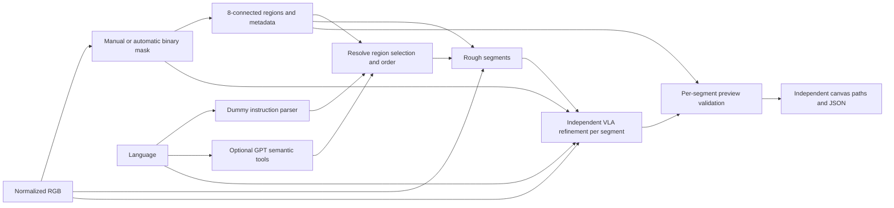
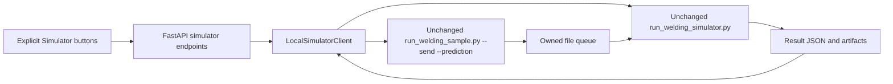

# Architecture and adapter contracts — schema v2

## Scope and invariants

현재 구현은 RGB + binary 2D mask + instruction으로 여러 개의 독립된 image-coordinate welding preview segment를 생성하는 로컬 MVP다. React/TypeScript/Vite/Konva가 FastAPI/Pydantic v2 REST/SSE API를 호출한다. segmentation/rough는 Dummy 또는 명시적으로 설정한 외부 VLM 함수를 사용한다. VLA와 수동 parser는 Dummy이며 선택적인 OpenAI Agents SDK Assistant가 구조화 지시와 Workflow orchestration을 담당한다. 물리 로봇은 연결하지 않는다. 별도 SimulatorClient는 외부 프로젝트의 기존 VLA prediction 샘플을 실행·모니터링한다. 웹 Preview trajectory는 시뮬레이터로 보내지 않는다.

## Native Segment / Rough boundary

`configured_clients()` injects `NativeSegmentClient` and `NativeRoughClient` for `native` (or the
migration alias `real`). `dummy` retains the existing full preview. The legacy image-only workers
and binary skeleton adapter are reachable only through explicit `experimental` configuration.
Native never calls worker.py, rough_worker.py or centerline.py and never synthesizes rough points.

The parity-verified interpreter is `C:/Users/hong_/anaconda3/envs/py3_12/python.exe`; child cwd is the
original sibling repository. `mask.py`/`cot.py` run via shell=False, -B and a process ownership gate.
Native SSH retrieval, prompts, SDK behavior and output formats remain original. All configs,
records and output directories must resolve inside Welding-Agent; siblings remain read-only.
Neither browser requests nor Agent tools can specify executable, cwd, config or artifact paths.
Native key-file lookup is preserved; inherited OPENAI_API_KEY is removed as in the parity run.

The native supervisor matches parity's stage watchdogs: setup 60s; `[RETRIEVE]` resets to 120s;
each `[GPT]`/`[REFINE]` resets to 240s, with an independent overall limit (default 900s).
`[RETRIEVED]`, artifacts and `[RESULT]` never extend a deadline. SDK timeout/retry is unchanged.
The stdout reader continuously drains merged stdout/stderr. Diagnostics retain UTC/monotonic
milestones plus observed artifact mtime; a separate bounded `.native.log` retains allowlisted
progress and safe exception summaries, never arbitrary request/error bodies or reasoning.
Forced cleanup is distinguished from natural process exit, even when Windows returns code 0.
Rough uses the original refiner → action retrieval → reference asset preparation → planner order.
Availability observations include query_rough_action/refiner/query_masks and final plan/Markdown/
overlay files without reading their content into diagnostics. Agent workspace/tool summaries expose
segment/point counts, frame, state and Markdown availability only. Dynamic retrieval can select
references outside a small parity dataset mirror; missing local native assets must fail before
accepting a RoughTrajectory, without silently substituting reference IDs or retrying inference.
Active Windows configs now use the extracted full dataset read-only: Segment receives the NIA
root, Rough receives its parent. The query-image binding points to the original full-dataset PNG;
pixel identity checks remain in force. Historical bounded caches/configs stay available for parity.

Protocol signatures remain `segment(image, *, instruction)` and
`predict(image, mask, instruction, components, *, language)`; Workflow attaches backend-owned
Mask metadata to the binary PIL image before calling Rough. Mask adds approved/approved_at;
old snapshots and Dummy masks retain their previous default confirmation behavior. Native
Segment sets approved=false. POST /api/masks/approve accepts only current job_id/mask_id and
records explicit confirmation; there is no Agent approval tool. A manual Canvas upload is an
explicit confirmation of its new immutable binary and carries native lineage through edits.
Instruction parsing and planning reject unapproved masks. Upstream edits invalidate downstream state.

`native_approval.py` builds a UUID session with exactly status.json and iteration_001/result.json,
matching native data.load_accepted_session. It does not fabricate model metrics/response IDs.
Only reviewed camera vectors enter the session. cot reads vectors, not PNG: the adapter retains
native geometry and clips it against the CURRENT approved binary. New painted geometry and
ambiguous multiple vectors per connected component are rejected, never silently ignored.
Separate proof JSON records current mask ID/source, pixel hash, timestamp, native lineage,
threshold and session file hashes. Verify these hashes before and after execution. Inputs and
native outputs are never overwritten. The original Segment --once session remains unapproved.

Normalized Rough uses only native points_pixel (cross-checked with points_normalized), native
segment decisions and operations. Component correspondence, selection, order, direction and
preview geometry must pass. Native plan stops at ROUGH_PATH_READY; refine explicitly rejects.
Native Markdown remains private native artifacts; Agent tools return summaries only. Artifact
envelopes store native session ID, relative file availability, lineage and approved input hash.
GET model status is read-only cached state, not a remote health/inference probe.

See [models.md](models.md) for actual view ordering, Windows configuration and smoke evidence.

### Separate spatial and Guided VLA boundary

`configured_rough3d_client()` explicitly selects the fixed sibling vlm_trajectory2 runtime and
v3 artifact parser; `configured_clients()` keeps the successful Rough2D baseline. ReferenceTrajectory3D
is retrieved teaching geometry, registered_to_query=false, never a VLA prediction. GuidedVLAClient
consumes only the query 2D JSON/structured direction and current explicitly approved F binary.
Its multipart fields are sample_id/split/cot/masks. Split comes from the original local NIA
Training/Validation label/source pairing; UUID attempts preserve hashes and reject stale approvals.
prepare/check are offline. Operator-only run --live claims one attempt before HTTP and validates
the response sample/split/(9,3)/finite/frame/metrics/guidance mode. task_metadata stays nested.
VLAPredictedTrajectory is a distinct private mm XYZ artifact with is_robot_executable=false;
it does not change WeldJob's image_pixel preview or trigger Simulator. See [guided-vla.md](guided-vla.md).

- Manual mask is 2D visual conditioning data and must not be automatically converted into 3D coordinates.
- GPT must never invent robot coordinates.
- Robot execution must never be directly triggered by an LLM.
- Mask may contain multiple disconnected welding regions.
- Each disconnected welding region must be represented as an independent weld segment.
- Different weld segments must never be connected as a continuous welding path by the orchestration layer.
- Travel motion between welding regions is a separate future robot-planning concern.



## Mask data and connected components

`mask_service.py` validates binary PNGs and generates a separate overlay. `components.py` performs connected-component analysis without new dependencies: NumPy finds horizontal foreground runs, and union-find joins runs on adjacent rows if they overlap or touch diagonally. Connectivity is **8**. This avoids recursive flood fill and scans runs instead of recursively visiting every pixel.

Regions are ordered by the first foreground pixel in row-major scan order (top to bottom, left to right). IDs are assigned **before** area filtering, so retained IDs stay stable across threshold changes on the same mask and may have gaps. Editing the mask can split/merge/reorder regions, so IDs belong to a specific confirmed mask. Reconfirmation invalidates old instructions and trajectories.

Each `MaskRegion` contains:

```json
{
  "region_id": 0,
  "pixel_area": 448,
  "bounding_box": {"x_min": 8, "y_min": 20, "x_max": 35, "y_max": 35},
  "centroid": {"x": 21.5, "y": 27.5}
}
```

Bounding-box maxima are inclusive. Centroid is the mean of foreground pixel coordinates. `MaskComponents.labels` is an internal same-size int32 array; background and filtered noise have label -1. The stored public `Mask` includes region metadata, `connectivity=8`, the applied threshold, discarded component count, and discarded pixel count. Labels are reconstructed from the immutable mask and saved threshold when planning/validating; they are not sent as a large JSON array.

The default minimum area is **16 pixels**, configurable with `WELD_MIN_COMPONENT_AREA`, `Workflow(min_component_area=...)`, multipart `min_component_area` on `/api/masks/manual`, or the same JSON field on `/api/masks/automatic`. It must be at least 1. Filtering excludes small regions from planning; it never changes the original binary PNG. `selected_pixels` still counts the original selection. A newly confirmed mask with no retained regions is rejected without advancing state.

Scene JPEG/PNG/WebP uploads are EXIF-normalized, converted to RGB and saved as PNG. This normalized size is authoritative. Canvas pointer positions and brush width are in original image pixels. Export rasterizes stroke/eraser history at full source resolution, thresholds alpha at 128, writes RGB channels 0/255 with alpha 255, and uploads an opaque PNG. Backend saves L-mode PNG. Display opacity does not affect binary data. The red VLA conditioning overlay is a separate RGB artifact.

## Trajectory and instruction schemas

The REST plan container remains `WeldJob`; `rough_trajectory` and `final_trajectory` each contain independent segments. `schema_version=2` identifies this contract. There is no top-level trajectory `points` compatibility alias, since consumers could accidentally reconnect regions.

```json
{
  "coordinate_space": "image_pixel",
  "units": "px",
  "is_robot_executable": false,
  "kind": "rough_preview",
  "generator": "dummy-component-column-median",
  "segments": [
    {"segment_id": 0, "region_id": 0, "mode": "weld", "points": [{"x": 10, "y": 25}]},
    {"segment_id": 1, "region_id": 2, "mode": "weld", "points": [{"x": 120, "y": 25}]}
  ]
}
```

`image_pixel` is singular and exact. Origin is top-left; x points right and y points down. Segment IDs are sequential within a newly generated plan, while region IDs refer to the confirmed mask. Filtering/skipping can leave gaps in region IDs. `mode` currently accepts only `weld`; a future `travel` mode requires a distinct robot-motion contract and planner. No stage automatically inserts travel or a line between segments.

The parser still handles the existing Korean horizontal direction commands. It returns direction intent; the workflow resolves region IDs from the confirmed mask. The parse endpoint accepts optional structured `region_selection`:

```json
{
  "job_id": "job UUID",
  "instruction": "왼쪽에서 오른쪽으로 용접해",
  "region_selection": {"start_region": 2, "region_order": [2, 0], "skip_regions": [1]}
}
```

The final `StructuredInstruction` contains `direction`, integer `start_region`, integer `region_order`, and integer `skip_regions`. If order is omitted, regions are sorted by centroid x, then y/ID, ascending for left-to-right and descending for right-to-left. An optional start ID moves that active region first. An explicit order must include each non-skipped region exactly once; an explicit start ID must match its first entry. Unknown/negative/non-integer IDs, duplicate IDs, a skipped start, inconsistent order, and an empty active set are rejected.

The UI provides include checkboxes; unchecked region IDs become `skip_regions`. Arbitrary natural-language skip/compound commands remain unsupported by the dummy parser and fail explicitly. Changing selection or language hides stale preview validation and requires Parse again. Language direction applies separately to every segment's point order, regardless of the requested region processing order.

## Model adapters and validation

| Protocol | Input | Output / behavior |
|---|---|---|
| InstructionParser | Raw text | Direction intent in StructuredInstruction, resolved against mask IDs by workflow |
| SegmentationClient | PIL RGB | Same-size PIL L mask; dummy synthetic center band |
| RoughPathClient | RGB, binary mask, resolved instruction, MaskComponents | One RoughTrajectory segment for each selected component |
| VLAClient | RGB, binary mask, rough segments, raw language, structured instruction | One independently refined final segment per rough segment |
| TrajectoryValidator | Trajectory, scene, MaskComponents, expected ordered segment/region pairs | Per-segment ValidationReport |
| IsaacClient | Status query | Disabled status; no execution methods |
| SimulatorClient | Empty explicit start/run/stop actions; status/log queries | Independent existing-sample runtime, injected into create_app; no web trajectory input |

The dummy rough client samples up to 32 foreground columns **per component**, chooses an actual foreground pixel near the column median, and reverses the point order when requested. It does not group regions by bounding box: components with overlapping x extents still produce independent segments.

The dummy VLA resamples each segment separately by arc length (at least 48 points for non-degenerate segments), applies mild smoothing, and preserves endpoints, segment ID, region ID, mode, count, and ordering. A single point remains a single point. No cross-segment interpolation or merging occurs.

Validation checks:

1. The trajectory has segments, and each segment has points.
2. Segment IDs are unique; each selected region has exactly one weld segment in this MVP.
3. Ordered `(segment_id, region_id)` pairs match the resolved selection for rough generation and the accepted rough trajectory for final validation.
4. Every region exists in the retained mask components; only weld mode is accepted.
5. Points are finite and lie in `[0,width-1] × [0,height-1]`.
6. At least 80% of each segment's points lie in its own component or within a 2-pixel square neighborhood of their rounded coordinate. Proximity to a different component does not count.

The report retains `scope="preview_geometry_only"` and `robot_safety_checked=false`, and explicitly includes `component_sanity_checked`, tolerance, and required ratio. Point schema also rejects NaN/Inf. Complex concave/branched components can cause a dummy path to fail this sanity check. This is a sparse point check, not a guarantee for every interpolated edge, welding quality, collision avoidance, workspace or joint limits.

## Workflow and persistence

```text
EMPTY → SCENE_READY → MASK_READY → INSTRUCTION_READY
      → ROUGH_PATH_READY → VLA_REFINED → VALIDATED
```

The backend owns state; requests cannot override it. Replacing a mask clears instruction and all downstream outputs. Parsing a new instruction/region selection clears trajectories and validation. `/rough`, `/refine`, and `/validate` enforce their exact prerequisite states. `/weld/plan` rejects requests before INSTRUCTION_READY, resumes missing stages, and returns an already validated result idempotently.

Bad rough output is rejected before storing a rough-ready state. Bad final output remains VLA_REFINED with a failed validation report and cannot reach VALIDATED. Each successful stage is persisted. Unexpected remote adapter failures should be translated by future adapters with explicit timeout/retry behavior.

`LocalStorage` writes immutable PNG artifacts and atomic JSON snapshots under:

```text
backend/storage/scenes/<scene UUID>.png
backend/storage/masks/<mask UUID>.png
backend/storage/masks/<mask UUID>.overlay.png
backend/storage/jobs/<job UUID>.json
backend/storage/jobs/<job UUID>.legacy-v1.json  # only after reading a legacy record
backend/storage/trajectories/<job UUID>.json
```

A single process-wide RLock prevents input replacement during a plan. This is single-worker local storage; use a database/per-job revision control before multi-worker or distributed jobs. UUID filenames avoid uploaded path names. Input limits remain 20 MiB, 12 MP, 8192px per side. Vite proxies `/api`; backend CORS supports the development origins. No keys are needed.

V1 records cannot be treated as valid v2: their single polyline may have bridged components. On first read, the storage layer preserves the original JSON as `.legacy-v1.json`, reanalyzes its mask with minimum area 1 (v1 had no filtering), clears instruction/paths/validation, records a migration event, and returns MASK_READY (or SCENE_READY if no mask exists). The user must parse and generate again. Scene/mask artifacts and IDs are preserved. No bulk rewrite or deletion of stored user artifacts runs during deployment. New API responses only use v2.

Frontend reload clears its in-memory stroke/session state as before. Its canvas renders one Line per segment, shows Region labels and retained count, and preserves Rough/Final toggles. Point totals sum the individual segments. Mask and instruction edits invalidate visible downstream results.

## Replacing clients later

Inject adapters into `Workflow(storage, parser=..., segmentation=..., rough=..., vla=..., validator=..., isaac=...)`; pass that workflow to `create_app(workflow=...)`. A remote VLA can POST RGB PNG, binary mask PNG, rough **segments**, raw language and structured instruction to a GPU server. Include schema version, image dimensions, frame and ordered segment/region IDs. Decode its response into FinalTrajectory and keep backend correspondence validation enabled. Do not modify external OpenVLA repositories from this project.

The OpenAI orchestrator interprets language and selects semantic workflow tools, but must not generate coordinates or bypass state/validation. Isaac integration requires a separate robot-coordinate schema, calibration, simulation, safety checks and explicit execution controls. Keep the mask as visual conditioning. Travel between weld segments belongs to that future planner.

## Conversational orchestration

`backend/agent` holds configuration, context, seven function tools, the `AgentRunner` Protocol/SDKRunner, SQLite sessions and run admission/SSE service. `create_app` injects the runner/settings independently of Workflow and SimulatorClient. Agent routes are in `backend/agent_routes.py`; existing endpoint paths and manual behavior remain available. `Workflow.apply_instruction` is the shared validated transition for parsed and Agent-provided structured instructions.

Only semantic direction and actual region IDs are tool inputs. `create_weld_preview_plan` calls the existing deterministic `Workflow.plan`, returns summary counts and preserves independent segments. Current workspace revisions and backend state remain authoritative. Session/job admission and manual mutation guards cover whole Agent runs. Tool calls are serialized even if a provider ignores `parallel_tool_calls=False`.

`SQLiteSession` memory is scoped to conversation + generation + job, with a separate sanitized UI transcript. SSE carries allowlisted progress, final public text and workspace invalidation notifications, never raw SDK events or hidden reasoning. Frontend `useAssistant` uploads dirty binary masks before sending, locks editing while running, refetches existing job snapshots on workspace events, and reconciles history after disconnection without replaying a request. The existing Canvas algorithms are unchanged. Assistant is the default Inspector tab; manual parsing lives in its disclosure.

Simulator actions require explicit current-message intent at the server tool boundary. A current-preview simulation request returns a fixed limitation message before the model runs. Only an explicit existing-sample request may start/wait for READY/replay the configured prediction; no preview data enters this interface. Tests inject fake adapters and do not call OpenAI or launch Isaac. See [agent.md](agent.md) for API, configuration, persistence, errors, tracing and manual live smoke.

## Existing simulator runtime

The external sibling simulator repository is read-only. `LocalSimulatorClient` is injected into `create_app(simulator=...)`, separately from Workflow. The original disabled IsaacClient describes **web preview submission**; `/api/simulator/status` describes the independent sample launcher. VALIDATED never launches anything.



Runtime state is STOPPED → STARTING → READY → RUNNING_SAMPLE → READY, with FAILED on errors and Stop returning STOPPED. A process-local RLock serializes mutations; an OS file lease prevents duplicate owned runtimes across backend instances. This remains a single-worker local service, not shared distributed runtime state. GET status and a background monitor both refresh state. Starting a process never blocks the HTTP request until Isaac is ready.

`WELD_SIM_LAUNCHER` explicitly selects the external environment, including Windows standalone python.bat; WELD_SIM_PYTHON is an optional legacy fallback. Backend Python runs only an ownership gate. The configured launcher runs Isaac. The backend owns the script allowlist, sample ID, input/export configuration and CLI arguments. Mutation endpoints accept an empty body only and reject query parameters and untrusted explicit browser origins. No commands, scripts, filesystem paths, image data, preview points or job IDs are accepted by the simulator API.

Windows Job Objects plus a stdin launch gate establish process-tree ownership before running external code. Stop and FastAPI shutdown close owned jobs; backend exit also closes job handles. A fresh per-start queue avoids stale request replay. Queue/output artifacts stay in Welding-Agent `.cache/simulator`; input/model files are read unchanged. Windows-only flock compatibility lives in Welding-Agent, not the external repository. Owned stderr/stdout are drained into bounded logs.

For .bat/.cmd, the gated bootstrap invokes fixed System32/cmd.exe /D /V:OFF /S /C with shell=False. Only quoted launcher/runner paths enter that command string; expansion/control characters there are rejected. Full script arguments and optional legacy import settings travel via a JSON environment manifest, preserving Unicode, spaces and parentheses without cmd interpolation. Both cmd and kit descendants belong to the parent's Job Object. Inherited PYTHONEXE is removed to avoid bypassing the standalone launcher environment.

WELD_SIM_SAMPLES_DIR forwards the existing --samples-dir and supersedes --data-root. An explicit legacy_npz format stages a per-run export inside .cache before invoking the original sample script. The adapter validates exact episode/H5 matching, finite XYZ arrays and GT resampled from H5 within 0.05 mm, then byte-copies NPZ and creates only the four metadata fields required by external welding_prediction.py. No fitting, GT substitution, original modification or invented split/metrics is allowed. Provenance hashes go into import_report.json. The original sample code still computes its fixture/IK solution and performs its own checks.

GET status only reads configuration and cached import diagnostics. `python -m backend.simulator_smoke --env-file .env` explicitly runs a fixed import-only probe without constructing SimulationApp. Successful imports are not GUI playback certification; the timestamped cache is invalidated when launcher identity changes. The real Windows batch import and real-data prediction contract were checked separately from automated stub tests.

Readiness requires the current process's exact `[READY] Waiting for samples in <current queue>` message. A live PID alone never reaches READY. Completion requires preparation exit=0, an explicit request ID, a matching model_predict result=done, and expected nonempty output artifacts plus the identifying VLA report. Errors and timeouts cancel both owned trees. The GUI has not been exercised automatically: unit tests stub the processes, and one lightweight subprocess test verifies Windows locking/child cleanup without importing Isaac.

See [simulator.md](simulator.md) for the investigation, configuration, manual GUI check, API/lifecycle details and future robot-coordinate interface. Physical robot execution remains disabled.

## Verification

Backend tests cover one/two/three components, side-by-side and vertically overlapping component bounds, metadata, diagonal connectivity, a separate flood-fill reference, stable IDs under noise filtering, region selection errors, skips and ordering, per-segment direction reversal, VLA correspondence, invalid adapter merges/reassignments, component proximity, and conservative legacy migration. Existing upload/mask/state/persistence tests remain.

Playwright uses separate test ports 8001/5174 and test storage, verifies the full browser flow, checks that gap pixels on the path canvas are transparent, verifies skip selection reaches the backend, preserves layer toggles, and covers a 390px viewport. On this Windows host, use fresh temporary and result directories to avoid native cleanup/cache failures. See README for commands and recorded test results.
